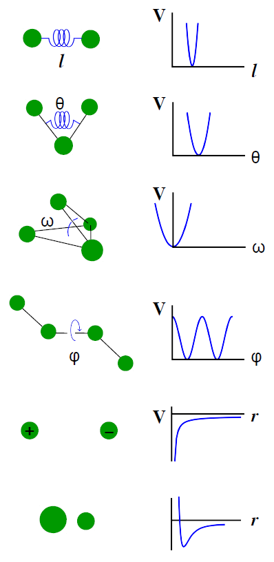

# Plot Potential

Created: 4 May 2021

Plot individual potential functions that comprise force fields. **Ideal for presentations.** 

Includes energy terms for:
* bonds (harmonic),
* angles (harmonic),
* proper torsion (periodic cosine),
* improper torsion (harmonic),
* van der Waals (Lennard-Jones),
* electrostatics (Coulomb), and
* the Morse potential.

Code and images are free to modify or use with citation of this work.  
The plotting code is all in **`plot_potential.py`**.  
**Author:** Victoria T. Lim  
**Source:** `https://github.com/vtlim/plot_potential`

Example output made with this code (based on [ref](https://cmm.cit.nih.gov/intro_simulation/node15.html)):  

